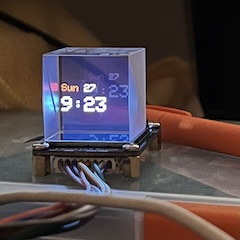

# ESP32 TFT LCD Cube Clock

A wifi-connected ESP32-based digital clock display using Adafruit_ST77XX library for LCD displays.




## Features

- Dims the backlight between 10pm and 7am, just to demo the pwm on the BL pin. 
- WiFi-connected NTP time synchronization
- TFT LCD display with customizable clock interface
- Environment variable configuration for WiFi credentials
- Support for ESP32-S3 and other ESP32 variants (with few changes)

## Hardware Requirements

- ESP32-S3 (or other ESP32 variant)
- TFT LCD display compatible with Adafruit_STXX library
- WiFi connection for time synchronization

## Setup Instructions

### 1. Install Dependencies

This project uses PlatformIO. Make sure you have PlatformIO installed.

### 2. Configure WiFi Credentials

Create a `.env` file in the project root directory with your WiFi credentials:

```bash
# Create .env file
touch .env
```

Add the following content to your `.env` file:

```
WIFI_SSID=YourWiFiNetworkName
WIFI_PASSWORD=YourWiFiPassword
```

**Important:** 
- Do not use quotes around the values
- Replace with your actual WiFi network name and password
- The `.env` file is automatically ignored by git for security

### 3. Build and Upload

```bash
# Build the project
pio run

# Upload to ESP32
pio run --target upload

# Monitor serial output
pio device monitor
```

You may need to press the reset button on the device (the qt py esp32-s3 in my case requires this due to a known boot issue with espressif).


## Project Structure

```
QT Py LCD Cube/
├── src/
│   ├── main.cpp              # Main application code
├── platformio.ini            # PlatformIO configuration
├── check_env.py             # Environment variable set
├── wifi_config.template     # WiFi setup instructions
├── .env                     # WiFi credentials (create this)
└── README.md               # This file
```

## Troubleshooting

### Build Errors about Missing Environment Variables

If you get build errors about `WIFI_SSID` or `WIFI_PASSWORD` not being defined:

1. Make sure you created the `.env` file in the project root
2. Check that the `.env` file contains the correct variable names
3. Ensure there are no quotes around the values
4. Restart your PlatformIO environment

## License
This project is based on Adafruit's TFT examples and is provided under the MIT license. 